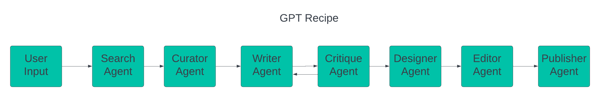

# GPT Recipe

Welcome to the GPT Recipe project, inspired by the [GPT Newspaper](https://github.com/rotemweiss57/gpt-newspaper.git). GPT Recipe harnesses the power of AI (OpenAI and TAVILY) to search, curate, write, critique, design, edit, and publish personalized recipe books tailored to your unique preferences. 

## Overview

GPT Recipe consists of seven specialized sub-agents in LangChain's new [LangGraph Library](https://github.com/langchain-ai/langgraph):

1. **Search Agent**: Seaches the web for the most relevant recipes using Tavily API.
2. **Curator Agent**: Filters and selects recipes based on user input keywords such as ingredients and cuisine types.
3. **Writer Agent**: Crafts reader-friendly recipes.
4. **Critique Agent**: Provides feedback on a given recipe using OpenAI's language model.
5. **Designer Agent**: Designs and organizes the recipe layout.
6. **Editor Agent**: Constructs the recipe book based on the produced recipes.
7. **Publisher Agent**: Publishes the recipe book to the frontend or desired service.

Each agent plays a critical role in delivering a unique and personalized recipe book experience.

<div align="center">
    
</div>

## Demo
[Watch the demo video](docs/gpt-recipe-demo.mp4)

## Features

- **Personalized Content**: Receive recipes tailored to your specific tastes and preferences.
- **Diverse Sources**: Access recipes from a wide range of reputable sources.
- **Engaging Design**: Enjoy a visually appealing and well-organized recipe layout.
- **Quality Assurance**: Benefit from rigorous editing that ensures reliable and accurate recipe instructions.
- **User-Friendly Interface**: Use an easy-to-navigate platform to set your preferences and receive your personalized recipe book.

## How It Works

1. **Setting Preferences**: Users input keywords for recipes, including interests, preferred ingredients, and cuisine types.
2. **Automated Curation**: The Search and Curator Agents find and select the most relevant recipes.
3. **Content Creation**: The Writer Agent drafts the recipes, and the Designer Agent designs them.
4. **Recipe Book Design**: The Editor Agent reviews and finalizes the recipe book content.
5. **Delivery**: Users receive their personalized recipe book.

## Getting Started

### Prerequisites

- Tavily API Key - [Sign Up](https://tavily.com/)
- OpenAI API Key - [Sign Up](https://platform.openai.com/)

### Installation

1. Clone the repo
   ```sh
   git clone https://github.com/nala-he/gpt-recipe.git

2. Export your API Keys
   ```sh
    export TAVILY_API_KEY=<YOUR_TAVILY_API_KEY>
    export OPENAI_API_KEY=<YOUR_OPENAI_API_KEY>

3. Install Requirements
    ```sh
    pip install -r requirements.txt

4. Run the app
    ```sh
    python app.py

5. Open the app in your browser
    ```sh
    http://localhost:5000/
    
6. Have fun searching for recipes and enjoying your meals!

## License

This project is licensed under the [MIT License](LICENSE).
